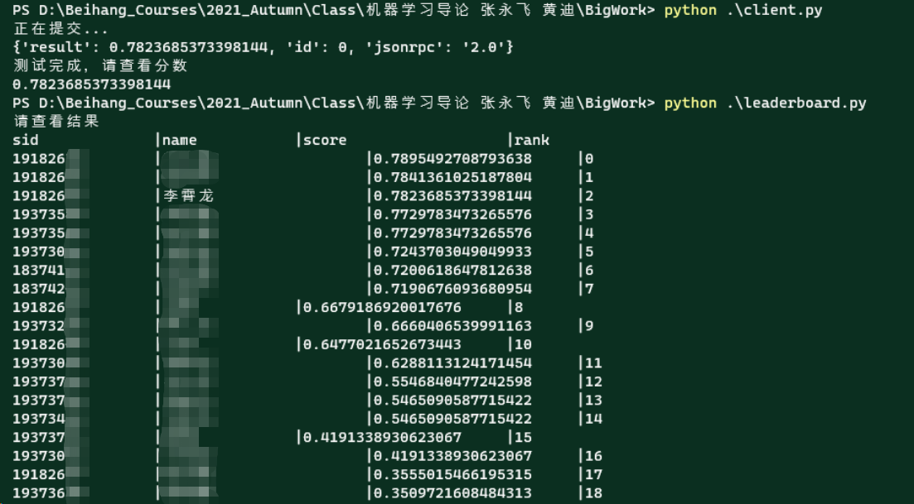

# 2021 Autumn ML-Teamwork

Teamwork Code, Opensource with GPLv2 License

## 团队作业 文本情感识别

对于社交平台的评论回复进行情感分析，判断其应属于的情感类别。

### **Author**:

19182655 19182604 19377180 (BUAA Sno)

### Data：

36206条训练数据， 9052测试数据，包含三种不同的情感标签 `Negative`， `Positive`， `Neutral`

**Training Set**：`DataSet/Train.csv`

**Test Set**：`DataSet/Test.csv`

### Evaluation：

**Micro-Fscore**

### Submit：

Submission.zip (submission.txt) 以测试集数据为顺序，每一行输出目标情感类别的字符串。

### Score：

### Methods

基于 **Bert** 针对下游任务进行的微调，具体可以查看 **report.pdf** 。

